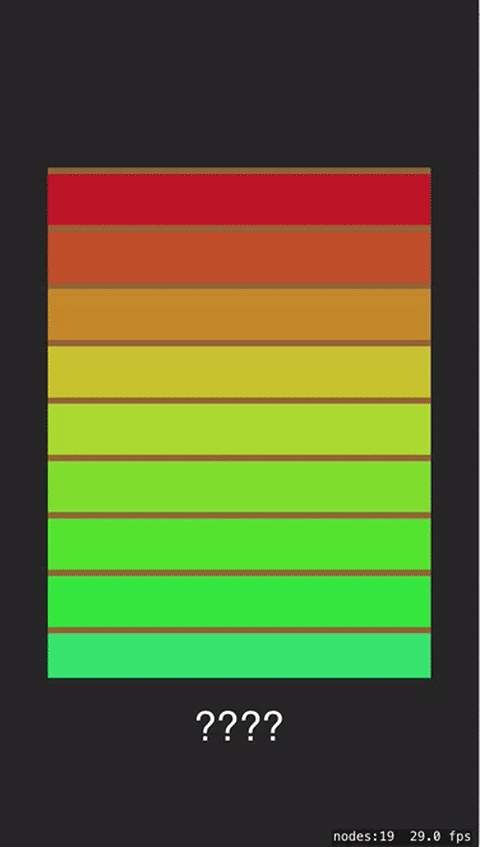

# Scrolling-List

This is a simple scrolling list that can be used with SpriteKit. 
This is not a replacement for the UITableView. This provides 
only a simple mechanism for scrolling a list sprite nodes. 

 
The list arranges all sprites in a vertical list. Sprites 
can be aligned to the left, right, or center. 
 
When initializing a list you will set it's size. This will 
determine the visible area for scrolling elements. 
 
Initialize with a size like this: 
 
    list = ScrollingList(size: CGSize(width: 300, height: 400))
 
Add sprite nodes as scrolling elements: 
 
    list.addNode(sprite)
 
ScrollingList sends a selectedRowNode() message to it's delegate when a row is selected. 
Note that dragging and tapping both involve touching a row. To differentiate between 
tapping a row and scrolling the list, the list measures the distance from the start of a drag, 
if the distance is less that 10 points selectedRowNode() is sent to the delegate.
